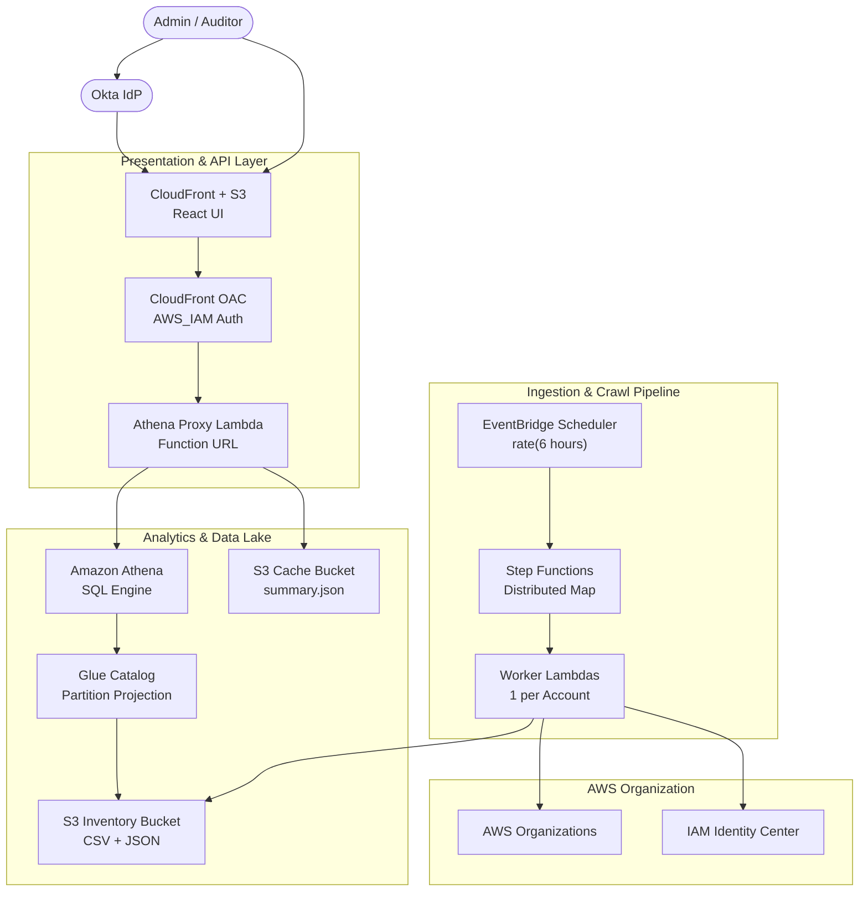

# AWS IAM Identity Center - Security Governance Dashboard

> **A serverless, open-source dashboard to audit IAM Identity Center (SSO) permission assignments, permission set configurations, and security risks across your entire AWS Organization — deployed in minutes with Terraform.**

<p align="center">
  
</p>

[](LICENSE)
[](https://www.terraform.io/)
[](https://aws.amazon.com/)
[](https://www.python.org/)
[](https://react.dev/)
[](https://github.com/alfredkzr/aws-iam-identity-center-security-governance-dashboard/pulls)

Full-org SSO crawl | Risk scoring | Historical snapshots | Audit trail | Export to CSV/PDF | Dark/light mode | ~$0.10-$5/month

---

## Table of Contents

- [Quick Start](#quick-start)
- [Configuration Reference](#configuration-reference)
- [Cost Estimate](#cost-estimate)
- [Dashboard Guide](#dashboard-guide)
- [Troubleshooting](#troubleshooting)
- [Advanced Setup](#advanced-setup)
- [Architecture](#architecture)
- [Reference](#reference)
- [Contributing](#contributing)
- [Uninstalling](#uninstalling)
- [License](#license)

---

## Quick Start

### Prerequisites

| Requirement | Version / Detail |
|-------------|------------------|
| **AWS Account** | IAM Identity Center enabled with AWS Organizations |
| **Terraform** | >= 1.5 |
| **Node.js** | >= 18 |
| **Python** | 3.12 |
| **AWS CLI** | v2, configured with deploy credentials |

### 1. Clone & Configure

```bash
git clone https://github.com/alfredkzr/aws-iam-identity-center-security-governance-dashboard.git
cd aws-iam-identity-center-security-governance-dashboard
cp terraform.tfvars.example terraform/terraform.tfvars
```

Edit `terraform/terraform.tfvars` and set the three required values:

```hcl
resource_prefix   = "myorg-idc-gov"                              # Must be globally unique (used in S3 bucket names)
sso_instance_arn  = "arn:aws:sso:::instance/ssoins-xxxxxxxx"     # IAM Identity Center → Settings → ARN
identity_store_id = "d-xxxxxxxxxx"                               # IAM Identity Center → Settings → Identity source
```

### 2. Deploy

```bash
cd terraform
terraform init && terraform apply
```

Terraform provisions all infrastructure, builds the React frontend, and uploads it to S3. The `frontend_url` output is your dashboard URL. First-time CloudFront creation takes 5-10 minutes.

### 3. First Crawl & Login

Trigger the initial crawl to populate the dashboard:

```bash
aws stepfunctions start-execution \
  --region $(terraform output -raw aws_region) \
  --state-machine-arn $(terraform output -raw step_functions_arn)
```

Open the `frontend_url` and log in with **admin** / **admin123**. Data appears within 1-3 minutes. Subsequent crawls run automatically every 6 hours.

For production SSO authentication, see [Advanced Setup](#sso-authentication-okta--azure-ad).

---

## Configuration Reference

All variables are set in `terraform/terraform.tfvars`. Required variables are marked with **R**.

| Variable | Type | Default | Description |
|----------|------|---------|-------------|
| **Core** | | | |
| `resource_prefix` **R** | `string` | — | Prefix for all resource names (3-31 chars, lowercase alphanumeric + hyphens, globally unique for S3) |
| `sso_instance_arn` **R** | `string` | — | ARN of your IAM Identity Center instance |
| `identity_store_id` **R** | `string` | — | Identity Store ID associated with the SSO instance |
| `aws_region` | `string` | `"us-east-1"` | AWS deployment region |
| `project_name` | `string` | `"idc-governance"` | Tag applied to all resources |
| `environment` | `string` | `"production"` | Environment tag |
| **SSO Authentication** | | | |
| `okta_domain` | `string` | `""` | Okta domain (e.g. `your-org.okta.com`) |
| `okta_client_id` | `string` | `""` | Okta OIDC client ID |
| `azure_tenant_id` | `string` | `""` | Azure AD / Entra ID tenant ID |
| `azure_client_id` | `string` | `""` | Azure AD / Entra ID OIDC client ID |
| **Local Auth** | | | |
| `local_admin_username` | `string` | `"admin"` | Dashboard login username (when no IdP is configured) |
| `local_admin_password` | `string` | `"admin123"` | Dashboard login password (when no IdP is configured) |
| `local_api_key` | `string` | `""` | Backend API key (auto-generated if empty; only used without IdP) |
| **Audit Trail** | | | |
| `cloudtrail_bucket` | `string` | `""` | S3 bucket with Organization CloudTrail logs (enables Audit Trail tab) |
| `cloudtrail_prefix` | `string` | `"AWSLogs"` | S3 key prefix for CloudTrail logs |
| `organization_id` | `string` | `""` | AWS Organization ID (required with `cloudtrail_bucket`) |
| `management_account_id` | `string` | `""` | Management account ID (required with `cloudtrail_bucket`) |
| **Schedule & Lifecycle** | | | |
| `crawler_schedule_interval` | `string` | `"6 hours"` | Crawl frequency (EventBridge rate syntax: `"6 hours"`, `"1 day"`) |
| `inventory_lifecycle_days` | `number` | `7` | Days before raw snapshots auto-delete from S3 |
| `athena_results_lifecycle_days` | `number` | `1` | Days before Athena query results auto-delete |
| `cache_lifecycle_days` | `number` | `1` | Days before cached API responses auto-delete |
| `log_retention_days` | `number` | `7` | CloudWatch Logs retention (days) |
| **Cost Controls** | | | |
| `worker_reserved_concurrency` | `number` | `10` | Max concurrent worker Lambda executions |
| `athena_proxy_reserved_concurrency` | `number` | `5` | Max concurrent API Lambda executions |
| `force_destroy_buckets` | `bool` | `false` | Allow `terraform destroy` to delete non-empty S3 buckets (dev/demo only) |

---

## Cost Estimate

Fully serverless — you only pay when things run. No fixed costs (no NAT Gateways, no RDS, no Glue Crawlers).

| Service | Role | Cost Driver |
|---------|------|-------------|
| **Step Functions** | Crawl orchestration | State transitions (biggest cost at scale) |
| **Lambda** | Crawl + API | Invocation count + duration |
| **S3** | Storage | Object count + storage (minimal with lifecycle) |
| **Athena** | SQL queries | Per TB scanned (typically KB-MB range) |
| **CloudFront** | CDN + API gateway | Data transfer out (cache hits are free) |
| **EventBridge** | Scheduler | Negligible (4 invocations/day) |
| **CloudWatch** | Logs | Retention-based (default: 7 days) |

### Estimated Monthly Cost

| Scale | Accounts | Crawls/Day | Estimated Cost |
|-------|----------|------------|----------------|
| **Small** | 20 | 4 | **~$0.10** |
| **Medium** | 100 | 4 | **~$0.50** |
| **Large** | 500 | 4 | **~$2.75** |

> Most small-to-medium deployments fall within the AWS Free Tier. Set `crawler_schedule_interval = "1 day"` to crawl once daily and cut Step Functions costs by ~75%.

---

## Dashboard Guide

### Assignments Tab

- **Search and filter** by principal name, account, or permission set
- **Sort** by any column header (click to toggle ascending/descending)
- **Snapshot selector** to browse historical crawl dates
- **Access Heatmap** shows principal counts per account x permission set matrix
- **Export** visible assignments to CSV or PDF

### Permission Sets Tab

- **Columns:** Name (with AWS Console deep link), Description, Provisioned count, Session Duration, Policies, Boundary, Inline Policy, Tags
- **Policy labels:** AWS managed policies as blue links; customer managed policies with yellow badge
- **Inline Policy:** expandable syntax-highlighted JSON viewer
- **Resizable columns:** drag any column header divider

### Security Tab

- **Risk Overview:** summary cards for Critical, High, Medium, and No Issues categories
- **Flagged Permission Sets:** all sets above "No Issues", showing matched rules and reasons
- **Rule Editor:** add, edit, or delete custom risk rules (exact and wildcard matching)
- **Default rules** based on CIS and Rhino Security research, restorable at any time
- **Export** risk policy rules to CSV or PDF

### Audit Trail Tab

- **Requires** CloudTrail integration — see [Advanced Setup](#audit-trail-cloudtrail-integration)
- **Date range picker** to scope the query (default: last 7 days)
- **Category filter** for All Changes, Assignment Changes, or Permission Set Changes
- **Search** by actor name, event type, or IP address
- **Expandable details** with full CloudTrail request parameters as JSON
- **Export** events to CSV

---

## Troubleshooting

### Dashboard shows "No data" after deployment

The dashboard needs at least one completed crawl. Trigger it manually:

```bash
aws stepfunctions start-execution \
  --region $(terraform output -raw aws_region) \
  --state-machine-arn $(terraform output -raw step_functions_arn)
```

Wait 1-3 minutes, then refresh the dashboard.

### Crawl fails with permission errors

Ensure the AWS account where you deploy has IAM Identity Center enabled and the `sso_instance_arn` and `identity_store_id` are correct. Check the Worker Lambda CloudWatch logs:

```bash
aws logs tail /aws/lambda/<resource_prefix>-worker --follow
```

### 403 Forbidden on CloudFront

This is normal during the first deployment — CloudFront takes 5-10 minutes to propagate. If it persists, check that the S3 bucket policy allows CloudFront OAC access (Terraform manages this automatically).

### "Authenticating..." spinner never resolves

Clear `sessionStorage` in your browser (DevTools -> Application -> Session Storage -> Clear). This removes stale tokens.

### Athena query timeout

The Athena Proxy Lambda has a 60-second timeout. For very large organisations (1000+ accounts), the first query after a crawl may take longer as Athena scans new partitions. Subsequent queries use the cache and return instantly.

### How do I check crawl status?

```bash
aws stepfunctions list-executions \
  --region $(terraform output -raw aws_region) \
  --state-machine-arn $(terraform output -raw step_functions_arn) \
  --max-results 5
```

---

## Advanced Setup

### SSO Authentication (Okta / Azure AD)

> **Optional.** Without an identity provider, the dashboard uses local auth with credentials embedded in the client-side JS bundle. Local auth is a development convenience, not a security boundary. Always configure SSO for production use.

Configure **one** identity provider at a time.

#### Option A: Okta

1. Log into your [Okta Admin Console](https://your-org-admin.okta.com/admin/apps/active)
2. Go to **Applications -> Create App Integration**
3. Select **OIDC - OpenID Connect** -> **Single-Page Application (SPA)**
4. Configure:

| Setting | Value |
|---------|-------|
| **App name** | `IAM Governance Dashboard` |
| **Grant type** | Authorization Code |
| **Sign-in redirect URI** (dev) | `http://localhost:3000/callback` |
| **Sign-in redirect URI** (prod) | `https://your-cloudfront-domain.cloudfront.net/callback` |
| **Sign-out redirect URI** (dev) | `http://localhost:3000` |
| **Sign-out redirect URI** (prod) | `https://your-cloudfront-domain.cloudfront.net` |

5. Copy the **Client ID**, then add to `terraform/terraform.tfvars`:

```hcl
okta_domain    = "your-org.okta.com"
okta_client_id = "0oaXXXXXXXXXXXXXXXXX"
```

6. Redeploy with `terraform apply`.

#### Option B: Microsoft Entra ID

1. Go to [Microsoft Entra admin center](https://entra.microsoft.com) -> **Identity** -> **Applications** -> **App registrations** -> **New registration**
2. Name it `IAM Governance Dashboard`, set **Supported account types** to **Accounts in this organizational directory only (Single tenant)**, click **Register**
3. From the app's **Overview** page, copy the **Application (client) ID** and **Directory (tenant) ID**
4. Go to **Manage** -> **Authentication** -> **Add a platform** -> **Single-page application**
5. Set **Redirect URIs**:
   - Dev: `http://localhost:3000/callback`
   - Prod: `https://your-cloudfront-domain.cloudfront.net/callback`
6. Do **not** check either checkbox under **Implicit grant and hybrid flows** (the dashboard uses Authorization Code + PKCE — no client secret required)
7. Under **API permissions**, verify `Microsoft Graph > User.Read` (delegated) is present (added by default)
8. Add to `terraform/terraform.tfvars`:

```hcl
azure_tenant_id = "xxxxxxxx-xxxx-xxxx-xxxx-xxxxxxxxxxxx"
azure_client_id = "xxxxxxxx-xxxx-xxxx-xxxx-xxxxxxxxxxxx"
```

9. Redeploy with `terraform apply`.

After deploying, add the production callback URL (`https://<cloudfront-domain>/callback`) to your IdP's redirect URI configuration.

#### Local Development with SSO

Create `frontend/.env` with your provider's variables:

```bash
# Okta
REACT_APP_OKTA_DOMAIN=your-org.okta.com
REACT_APP_OKTA_CLIENT_ID=0oaXXXXXXXXXXXXXXXXX

# OR Azure AD
REACT_APP_AZURE_TENANT_ID=xxxxxxxx-xxxx-xxxx-xxxx-xxxxxxxxxxxx
REACT_APP_AZURE_CLIENT_ID=xxxxxxxx-xxxx-xxxx-xxxx-xxxxxxxxxxxx
```

The frontend uses Authorization Code + PKCE with auto-detected provider. Tokens are stored in `sessionStorage`. The backend validates tokens by calling the provider's OIDC userinfo endpoint (with in-memory caching). Tokens are passed via the `X-Auth-Token` header because CloudFront OAC replaces the `Authorization` header with its own SigV4 signature.

### Audit Trail (CloudTrail Integration)

> **Optional.** The Audit Trail tab shows who assigned/removed permission sets and who created/modified permission set configurations. It also enriches the Assignments and Permission Sets tabs with "Assigned By" and "Created/Updated By" columns. Queries CloudTrail via Athena at zero fixed cost. Attribution data only appears for changes made after the Organization Trail is created.

#### Step 1: Check for Existing Trail

```bash
aws cloudtrail describe-trails --query 'trailList[?IsOrganizationTrail==`true`].[Name,S3BucketName]' --output table
```

If you see a trail, skip to [Step 3](#step-3-cross-account-access).

#### Step 2: Create an Organization Trail (if needed)

Run from the **management account**. The first management event trail is free.

```bash
# Set your management account profile
export AWS_PROFILE=your-management-account-profile

# Get your Organization ID
ORG_ID=$(aws organizations describe-organization --query 'Organization.Id' --output text)
MGMT_ACCOUNT=$(aws sts get-caller-identity --query 'Account' --output text)
BUCKET_NAME="your-org-cloudtrail"
REGION="ap-southeast-1"  # Use your preferred region

# 1. Create S3 bucket
aws s3api create-bucket \
  --bucket $BUCKET_NAME \
  --region $REGION \
  --create-bucket-configuration LocationConstraint=$REGION

# 2. Secure the bucket
aws s3api put-public-access-block \
  --bucket $BUCKET_NAME \
  --public-access-block-configuration \
    BlockPublicAcls=true,IgnorePublicAcls=true,BlockPublicPolicy=true,RestrictPublicBuckets=true

aws s3api put-bucket-encryption \
  --bucket $BUCKET_NAME \
  --server-side-encryption-configuration \
    '{"Rules":[{"ApplyServerSideEncryptionByDefault":{"SSEAlgorithm":"AES256"},"BucketKeyEnabled":true}]}'

# 3. Set lifecycle (1 year retention)
aws s3api put-bucket-lifecycle-configuration \
  --bucket $BUCKET_NAME \
  --lifecycle-configuration \
    '{"Rules":[{"ID":"ExpireCloudTrailLogs","Status":"Enabled","Filter":{"Prefix":"AWSLogs/"},"Expiration":{"Days":365}}]}'

# 4. Set bucket policy (CloudTrail write access)
aws s3api put-bucket-policy --bucket $BUCKET_NAME --policy "{
  \"Version\": \"2012-10-17\",
  \"Statement\": [
    {
      \"Sid\": \"AWSCloudTrailAclCheck\",
      \"Effect\": \"Allow\",
      \"Principal\": {\"Service\": \"cloudtrail.amazonaws.com\"},
      \"Action\": \"s3:GetBucketAcl\",
      \"Resource\": \"arn:aws:s3:::$BUCKET_NAME\",
      \"Condition\": {\"StringEquals\": {\"AWS:SourceArn\": \"arn:aws:cloudtrail:$REGION:$MGMT_ACCOUNT:trail/org-management-trail\"}}
    },
    {
      \"Sid\": \"AWSCloudTrailWrite\",
      \"Effect\": \"Allow\",
      \"Principal\": {\"Service\": \"cloudtrail.amazonaws.com\"},
      \"Action\": \"s3:PutObject\",
      \"Resource\": \"arn:aws:s3:::$BUCKET_NAME/AWSLogs/$MGMT_ACCOUNT/*\",
      \"Condition\": {\"StringEquals\": {\"s3:x-amz-acl\": \"bucket-owner-full-control\", \"AWS:SourceArn\": \"arn:aws:cloudtrail:$REGION:$MGMT_ACCOUNT:trail/org-management-trail\"}}
    },
    {
      \"Sid\": \"AWSCloudTrailOrgWrite\",
      \"Effect\": \"Allow\",
      \"Principal\": {\"Service\": \"cloudtrail.amazonaws.com\"},
      \"Action\": \"s3:PutObject\",
      \"Resource\": \"arn:aws:s3:::$BUCKET_NAME/AWSLogs/$ORG_ID/*\",
      \"Condition\": {\"StringEquals\": {\"s3:x-amz-acl\": \"bucket-owner-full-control\", \"AWS:SourceArn\": \"arn:aws:cloudtrail:$REGION:$MGMT_ACCOUNT:trail/org-management-trail\"}}
    }
  ]
}"

# 5. Enable CloudTrail service access for Organizations
aws organizations enable-aws-service-access --service-principal cloudtrail.amazonaws.com

# 6. Create the Organization Trail
aws cloudtrail create-trail \
  --name org-management-trail \
  --s3-bucket-name $BUCKET_NAME \
  --is-organization-trail \
  --is-multi-region-trail \
  --region $REGION

# 7. Start logging
aws cloudtrail start-logging --name org-management-trail --region $REGION
```

#### Step 3: Cross-Account Access

If the dashboard is deployed in a **delegated admin account** (not the management account), add a read policy to the CloudTrail bucket so the dashboard Lambda can query the logs.

Run from the **management account** — add this statement to the existing bucket policy:

```json
{
    "Sid": "AllowDashboardLambdaRead",
    "Effect": "Allow",
    "Principal": {
        "AWS": "arn:aws:iam::<delegated-admin-account-id>:role/<resource-prefix>-athena-proxy-lambda-role"
    },
    "Action": [
        "s3:GetObject",
        "s3:ListBucket",
        "s3:GetBucketLocation"
    ],
    "Resource": [
        "arn:aws:s3:::<cloudtrail-bucket>",
        "arn:aws:s3:::<cloudtrail-bucket>/*"
    ]
}
```

#### Step 4: Configure and Deploy

Add to `terraform/terraform.tfvars`:

```hcl
cloudtrail_bucket     = "your-org-cloudtrail"
organization_id       = "o-xxxxxxxxxx"
management_account_id = "123456789012"
```

Find these values:

```bash
# Organization ID
aws organizations describe-organization --query 'Organization.Id' --output text

# Management account ID
aws organizations describe-organization --query 'Organization.MasterAccountId' --output text
```

Redeploy with `terraform apply`. The Audit Trail tab appears automatically.

**How it works:** CloudTrail logs every IAM Identity Center API call with actor attribution. Logs arrive in S3 within 5-15 minutes. The dashboard queries them via Athena. Only SSO-related events are queried (`eventsource = sso.amazonaws.com`). Cost: first management trail is free; Athena queries cost ~$0.001-0.01 each.

### Post-Deployment Hardening

| Action | Why | How |
|--------|-----|-----|
| **Configure SSO** | Local auth credentials are in the JS bundle | See [SSO Authentication](#sso-authentication-okta--azure-ad) |
| **Attach AWS WAFv2** | DDoS, bots, OWASP Top 10 protection | Create `aws_wafv2_web_acl` with AWS Managed Rules, associate with CloudFront |
| **Custom domain + TLS** | Replace `*.cloudfront.net` | ACM certificate in `us-east-1` + Route 53 alias + `viewer_certificate` block |
| **Geo-restriction** | Limit access to operating regions | `restrictions.geo_restriction` in CloudFront |
| **Security headers** | HSTS, X-Frame-Options, CSP | `aws_cloudfront_response_headers_policy` with security headers |
| **Restrict CORS** | Lock API to your domain | Update CORS headers in Athena Proxy handler |

---

## Architecture



**Data flow:**
1. **Crawl** — EventBridge triggers Step Functions on a schedule. Worker Lambdas crawl each AWS account's assignments in parallel via Distributed Map, then crawl all permission set details. Results are written to S3 as Hive-partitioned CSV and JSON.
2. **Query** — Athena queries the data via Glue Catalog (partition projection, no Glue Crawlers). The Athena Proxy Lambda serves a cached `summary.json` from S3 first, falling back to Athena SQL on cache miss.
3. **Display** — The React SPA is served from S3 via CloudFront. API requests go through CloudFront's `/api*` path behaviour to the Athena Proxy Lambda Function URL (secured with CloudFront OAC + AWS_IAM auth).

**Built-in security controls:**

| Control | Detail |
|---------|--------|
| S3 Encryption | AES-256 server-side encryption with bucket keys on all buckets |
| Public Access Blocked | All S3 buckets block public ACLs, policies, and restrict public access |
| CloudFront OAC | Origin Access Control secures both S3 and Lambda Function URL origins with SigV4 |
| AWS_IAM Auth | Lambda Function URL requires IAM authorization — no anonymous access |
| OIDC Token Validation | Backend validates tokens against the configured IdP's userinfo endpoint |
| SQL Injection Prevention | Table names validated with regex `^[a-zA-Z_][a-zA-Z0-9_]*$` |
| Query Allowlist | API only accepts predefined query types |
| Least-Privilege IAM | All Lambda roles scoped to exactly the required actions and resources |
| Auto-Expiry Lifecycle | S3 objects auto-delete (inventory: 7d, results: 1d, cache: 1d) |
| Reserved Concurrency | Lambda concurrency limits control blast radius and cost |
| PKCE Flow | Authorization Code + PKCE (no client secret in browser) |
| Session Storage | Auth tokens in `sessionStorage` (cleared on tab close) |

---

## Reference

### IAM Permissions

These are the exact IAM permissions the deployed tool uses at runtime (not what the deployer needs). All roles follow least privilege.

**Worker Lambda** — crawls assignments and permission sets:

```
sso:ListAccountAssignments          sso:ListPermissionSets
sso:DescribePermissionSet           sso:ListAccountsForProvisionedPermissionSet
sso:ListManagedPoliciesInPermissionSet
sso:GetInlinePolicyForPermissionSet
sso:ListCustomerManagedPolicyReferencesInPermissionSet
sso:GetPermissionsBoundaryForPermissionSet
sso:ListTagsForResource
identitystore:DescribeUser          identitystore:DescribeGroup
identitystore:ListGroupMemberships
organizations:ListAccounts          organizations:DescribeAccount
s3:PutObject                        s3:GetObject (inventory bucket only)
logs:CreateLogGroup/Stream          logs:PutLogEvents
```

**Athena Proxy Lambda** — serves API, queries Athena, manages cache:

```
athena:StartQueryExecution           athena:GetQueryExecution
athena:GetQueryResults               athena:StopQueryExecution
glue:GetTable     glue:GetDatabase   glue:GetPartitions
glue:GetDatabases glue:GetTables
s3:GetObject  s3:PutObject  s3:ListBucket  s3:GetBucketLocation
  (inventory, athena-results, and cache buckets)
logs:CreateLogGroup/Stream           logs:PutLogEvents
```

**Step Functions** — orchestrates the 3-phase crawl:

```
lambda:InvokeFunction (worker Lambda only)
organizations:ListAccounts
states:StartExecution  states:DescribeExecution  states:StopExecution
logs:CreateLogDelivery  logs:PutResourcePolicy  logs:DescribeLogGroups
```

**Deployer permissions** — the IAM principal running `terraform apply` needs permissions to create:

| Service | Resources Created |
|---------|-------------------|
| **S3** | 4 buckets (inventory, cache, athena-results, frontend) |
| **Lambda** | 2 functions (worker, athena-proxy) + Function URL |
| **IAM** | 4 roles + policies (worker, proxy, step-functions, scheduler) |
| **Step Functions** | 1 state machine (Standard type) |
| **Athena** | 1 workgroup |
| **Glue** | 1 database + 2 tables (catalog only, no crawlers) |
| **CloudFront** | 1 distribution + OAC |
| **EventBridge** | 1 scheduler rule |
| **CloudWatch Logs** | 3 log groups |

### Data Schema

**Assignments Table** (CSV, Hive-partitioned at `s3://{inventory_bucket}/assignments/snapshot_date=YYYY-MM-DD/{account_id}.csv`):

| Column | Type | Description |
|--------|------|-------------|
| `account_id` | string | AWS account ID |
| `account_name` | string | AWS account name |
| `principal_type` | string | `USER`, `GROUP`, or `USER_VIA_GROUP` |
| `principal_id` | string | Identity Store principal ID |
| `principal_name` | string | Resolved display name |
| `principal_email` | string | Email address (empty for groups) |
| `permission_set_name` | string | Permission set name |
| `permission_set_arn` | string | Permission set ARN |
| `group_name` | string | Group name (if user is assigned via group) |
| `created_date` | string | Assignment creation date |

**Permission Sets Table** (JSON, Hive-partitioned at `s3://{inventory_bucket}/permission_sets/snapshot_date=YYYY-MM-DD/permission_sets.json`):

| Field | Type | Description |
|-------|------|-------------|
| `name` | string | Permission set name |
| `arn` | string | Permission set ARN |
| `description` | string | Description |
| `session_duration` | string | ISO 8601 duration (e.g. `PT4H`) |
| `created_date` | string | Creation timestamp |
| `aws_managed_policies` | array | List of `{name, arn}` objects |
| `customer_managed_policies` | array | List of `{name, path}` objects |
| `inline_policy` | string | JSON policy document (stringified) |
| `permissions_boundary` | object | Boundary policy reference (or null) |
| `tags` | array | List of `{Key, Value}` objects |
| `provisioned_accounts` | number | Number of accounts this set is provisioned to |

Both tables use Glue partition projection — no Glue Crawlers needed, partitions are auto-discovered.

### API Reference

**Base URL:** `https://{cloudfront_domain}/api`

All requests require the `X-Auth-Token` header when SSO is configured.

| Parameter | Required | Description |
|-----------|----------|-------------|
| `type` | Yes | Query type (see below) |
| `date` | No | Snapshot date `YYYY-MM-DD` (defaults to latest) |
| `force` | No | Set to `true` to bypass cache and query Athena directly |

| Type | Method | Description |
|------|--------|-------------|
| `all` | GET | All assignments for a snapshot date |
| `summary` | GET | Aggregated stats (cached) |
| `dates` | GET | Available assignment snapshot dates |
| `permission_sets` | GET | All permission sets for a snapshot date |
| `permission_sets_dates` | GET | Available permission set snapshot dates |
| `risk_policies` | GET | Current risk policy rules (custom or defaults) |
| `save_risk_policies` | POST | Save custom risk policy rules (JSON body) |

All responses return JSON with CORS headers. Error responses return `{"error": "message"}`. Cache TTL is 1 hour; use `force=true` to bypass.

### Project Structure

```
aws-iam-identity-center-security-governance-dashboard/
├── terraform/                         # Infrastructure as Code
│   ├── main.tf                        # Provider & backend configuration
│   ├── variables.tf                   # All configurable input variables
│   ├── outputs.tf                     # Terraform outputs (URLs, ARNs, bucket names)
│   ├── s3.tf                          # S3 buckets (inventory, cache, athena-results)
│   ├── frontend_hosting.tf            # S3 + CloudFront + OAC (auto-builds & deploys frontend)
│   ├── lambda.tf                      # Lambda functions (worker + athena proxy) + Function URL
│   ├── iam.tf                         # IAM roles & policies (least privilege)
│   ├── athena.tf                      # Athena workgroup + Glue catalog (partition projection)
│   ├── stepfunctions.tf               # Step Functions state machine (3-phase crawler)
│   └── eventbridge.tf                 # EventBridge scheduled trigger
├── backend/
│   ├── worker/                        # Crawler Lambda (Python 3.12, ARM64)
│   │   ├── handler.py                 # Lambda handler (list accounts, crawl assignments, crawl permission sets)
│   │   └── default_risk_policies.py   # Default risk scoring rules
│   └── athena_proxy/                  # API Lambda (Python 3.12, ARM64)
│       ├── handler.py                 # Lambda handler (query, cache, token validation)
│       └── default_risk_policies.py   # Default risk scoring rules (must stay in sync with worker/)
├── frontend/                          # React 18 SPA (plain JavaScript, no TypeScript)
│   ├── public/
│   │   └── index.html                 # HTML shell with FOUC-prevention theme script
│   └── src/
│       ├── App.js                     # Main app (tabs, data fetching, demo data fallback)
│       ├── index.css                  # Design system (CSS custom properties, light + dark themes)
│       ├── auth/
│       │   └── AuthContext.js         # Multi-IdP OIDC (Okta/Azure AD) + PKCE + local auth fallback
│       ├── hooks/
│       │   └── useTheme.js            # Dark/light mode hook (localStorage + OS preference)
│       └── components/
│           ├── Header.js              # Top navigation + theme toggle
│           ├── LoginPage.js           # Authentication page
│           ├── Dashboard.js           # Assignments tab (table, toolbar, stats)
│           ├── GovernanceCharts.js     # Visualisations (bar charts, access heatmap)
│           ├── PermissionSetsTable.js  # Permission sets tab (resizable, expandable)
│           └── SecurityTab.js         # Security risk tab (scoring, rule editor)
├── terraform.tfvars.example           # Configuration template — copy to terraform/terraform.tfvars
└── README.md
```

---

## Contributing

Contributions are welcome. See [CLAUDE.md](CLAUDE.md) for code conventions, architecture details, and common commands.

### Submitting Changes

1. Fork the repository
2. Create a feature branch: `git checkout -b feature/your-feature`
3. Commit your changes: `git commit -m 'feat: add your feature'`
4. Push: `git push origin feature/your-feature`
5. Open a Pull Request

### Reporting Issues

Please [open an issue](https://github.com/alfredkzr/aws-iam-identity-center-security-governance-dashboard/issues) with:
- A clear description of the problem
- Steps to reproduce
- Expected vs actual behaviour
- Relevant logs or Terraform output

---

## Uninstalling

To remove all deployed resources:

1. Add to `terraform/terraform.tfvars`:

```hcl
force_destroy_buckets = true
```

2. Apply the change, then destroy:

```bash
cd terraform
terraform apply        # Applies the force_destroy flag
terraform destroy      # Removes all resources
```

CloudFront distributions can take 10-15 minutes to fully delete. Terraform waits for this automatically.

---

## License

[MIT](LICENSE) — free to use, modify, and distribute.
